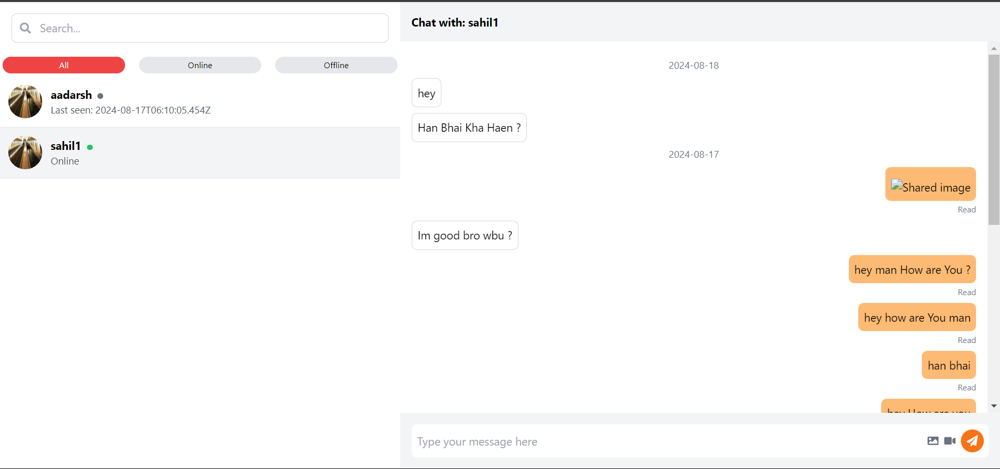
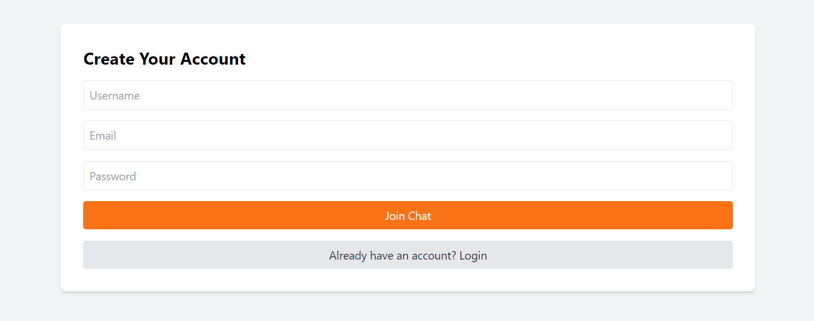
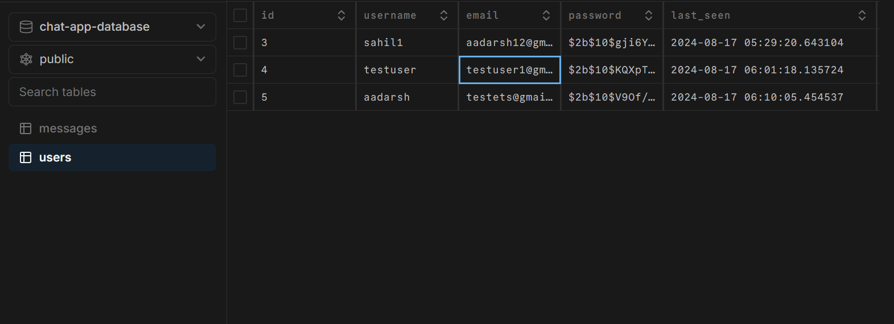
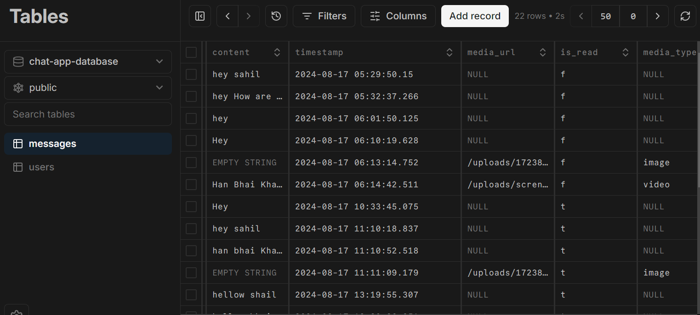

# Real-Time Chat Application

## Overview

This project is a real-time chat application built with modern web technologies. It allows users to communicate instantly, see online/offline status, receive typing indicators, and share media files.

## Features

- Real-time messaging between users
- User authentication (signup and login)
- Online/offline status indicators
- "Typing..." indicator while chatting
- Read/unread message sorting system
- Image and video upload functionality
- Infinite scrolling of messages
- Last seen timestamp for users

## Tech Stack

### Frontend
- React (Vite)
- Tailwind CSS
- Socket.IO Client

### Backend
- Node.js
- Express.js
- Socket.IO
- Neon Postgres (Database)
- Drizzle ORM

### Authentication & Security
- bcrypt (for password hashing)
- JSON Web Tokens (JWT)

## Project Structure

The project is divided into two main folders:

1. `chatapp/`: Contains the frontend React application
2. `server/`: Houses the backend Node.js server

## Prerequisites

- Node.js (v14 or later recommended)
- npm (Node Package Manager)
- PostgreSQL database (We're using Neon Postgres)

## Setup & Installation

1. Clone the repository:
- git clone https://github.com/HimanshuSinghBhandari/chatapp.git
- cd [repo-name]

2. Install dependencies for both frontend and backend:
- cd chatapp
- npm install
- cd server
- npm install

3. Set up your environment variables:
- Create a `.env` file in the `server` directory with the following content:

- PORT=3001
- CLIENT_URL=http://localhost:5173
- DATABASE_URL="postgresql://1234chatapp@hshidi-ishhd-east-2.aws.neon.tech/chat-app-database?sslmode=require"
- JWT_SECRET=1234536gshsjjs

Note: Replace the `DATABASE_URL` and `JWT_SECRET` with your actual database URL and a secure secret key.

4. Database Setup:
The application uses two main tables:
- `users`: Stores user information (username, email, password, last_seen, isonline)
- `messages`: Stores chat messages (sender_id, receiver_id, content, timestamp, media_url, media_type, isread)

Ensure your database is set up with these tables. You can use Drizzle ORM migrations to set up your database schema.

## Running the Application

1. Start the backend server:
- cd server
- npm run dev

The server should start on `http://localhost:3001`

2. In a new terminal, start the frontend application:
- cd chatapp
- npm run dev

The React app should start on `http://localhost:5173`

3. Open your browser and navigate to `http://localhost:5173` to use the application.

## Usage

1. Sign up for a new account or log in if you already have one.
2. After authentication, you'll see a list of available users from the database.
3. Click on a user to start a chat.
4. Send messages, images, or videos in real-time.
5. Observe online/offline status, typing indicators, and read/unread messages.
6. Scroll up to load older messages (infinite scrolling).

## Key Components

- **Authentication**: Uses bcrypt for password hashing and JWT for secure user sessions.
- **Real-time Communication**: Implemented using Socket.IO for instant messaging and status updates.
- **File Uploads**: Images and videos are stored in the `upload` folder on the server, with references saved in the database.
- **Database Interactions**: Utilizes Drizzle ORM for efficient and type-safe database operations.

## Security Considerations

- Passwords are hashed using bcrypt before storing in the database.
- JWT is used for maintaining secure sessions.
- Ensure to keep your `.env` file confidential and never commit it to version control.
- Implement proper input validation and sanitization (both client-side and server-side) to prevent SQL injection and XSS attacks.

## Scalability

For larger deployments, consider:
- Implementing a caching layer (e.g., Redis) for frequently accessed data.
- Using a load balancer for distributing traffic across multiple server instances.
- Optimizing database queries and indexing for improved performance.
